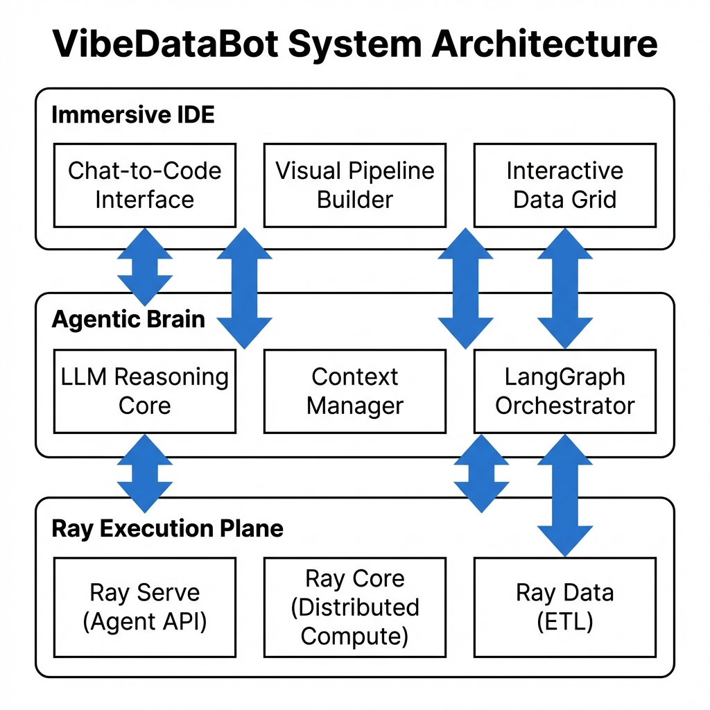

# VibeDataBot 🤖

> **Immersive Agentic Data Development Environment**  
> *Powered by Ray, Built with Next.js & Tailwind*

VibeDataBot is an experimental web-based prototype designed to reimagine the experience of AI data engineering. It combines the aesthetic of a modern "Dark Mode" IDE with the power of an intelligent agent that can plan, visualize, and execute data pipelines on a Ray cluster.



## ✨ Key Features

- **Immersive Workspace**: A sleek, dark-themed interface designed for focus. "IDE-like" experience with a collapsible sidebar and main canvas.
- **Agentic Workflow**:
    -   **Natural Language Interface**: Chat with the bot to describe data tasks (e.g., "Load S3 logs and scan for PII").
    -   **Simulated Reasoning**: Watch the agent "Think", "Plan", and "Execute" in real-time.
    -   **Streaming Logs**: Live feedback from the (simulated) backend execution.
- **Visual Pipeline Builder**:
    -   **Auto-generated DAGs**: The agent visualizes its plan as an interactive graph.
    -   **Interactive Nodes**: Click on pipeline steps to debug or view intermediate results.
- **Rich Data Previews**:
    -   **Integrated DataFrames**: View tabular data directly in the canvas.
    -   **Visual Scanning**: Highlight PII or anomalies directly in the grid.
- **Resource Management**:
    -   **Cluster Monitoring**: View mock stats for Ray Clusters (CPU/GPU, Active Jobs).
    -   **Data Catalog**: Browse internal (Postgres/Snowflake) and external (HuggingFace/S3) data sources.

## 🏗️ Architecture

### Target System Architecture

```mermaid
graph TD
    User[User / Developer] -->|Natural Language / Actions| UI[VibeDataBot UI \n (Next.js)]
    
    subgraph "Frontend Layer"
        UI -->|Component| AgentFE[Agent Interface]
        UI -->|Component| Visualizer[Pipeline Visualizer]
        UI -->|Component| Resources[Resource Manager]
    end

    subgraph "Control Plane (Goal)"
        AgentFE -.->|REST / gRPC| Gateway[API Gateway]
        Gateway -->|Manage| RayServe[Ray Serve \n (Agent Backend)]
        RayServe -->|Inference| LLM[LLM Reasoning Core]
        RayServe -->|Plan| Planner[Execution Planner]
    end

    subgraph "Ray Data Plane"
        Planner -->|Submit Job| RayCluster[Ray Cluster]
        RayCluster -->|Ray Data| Processing[Data Processing \n (ETL / PII Spec)]
        RayCluster -->|Distributed| Workers[Ray Workers]
    end

    subgraph "Data Layer"
        Processing <-->|Read/Write| S3[S3 / Data Lake]
        Processing <-->|Query| DB[Warehouses \n (Snowflake/Postgres)]
        Processing <-->|Download| HF[HuggingFace Hub]
    end

    style UI fill:#1a1b26,stroke:#7aa2f7,color:#fff
    style RayCluster fill:#ff69b4,stroke:#fff,color:#000,stroke-width:2px
    style LLM fill:#41a6b5,stroke:#fff,color:#fff
```

The project currently implements the **Frontend Layer** with simulated connections to the backend.

The project follows a **Feature-based Modular Architecture** for scalability and maintainability:

```
/features
  ├── /agent        # Core Logic: Agent Context, Chat Interface, Main Canvas
  ├── /navigation   # Sidebar, Routing components
  ├── /resources    # Resource Details (Clusters, Data Sources)
  ├── /pipeline     # Pipeline Visualization (DAGs)
  └── /data-view    # Data Tables & Schema Viewers
```

**Tech Stack:**
-   **Framework**: Next.js 14+ (App Router)
-   **Styling**: TailwindCSS (Custom configuration)
-   **UI Components**: Lucide React, Radix UI primitives
-   **Animations**: Framer Motion

## 🚀 Getting Started

### Prerequisites
-   Node.js 18+
-   npm / yarn / pnpm

### Installation

1.  Clone the repository:
    ```bash
    git clone https://github.com/li-clement/LLM-Data-Studio.git
    cd LLM-Data-Studio/ray-data-agent-proto
    ```

2.  Install dependencies:
    ```bash
    npm install
    ```

3.  Run the development server:
    ```bash
    npm run dev
    ```

4.  Open [http://localhost:3000](http://localhost:3000) in your browser.

## 🤝 Contributing

This is a prototype / concept validation project. Contributions are welcome to migrate the simulated logic to real Ray bindings!

## 📄 License

MIT
